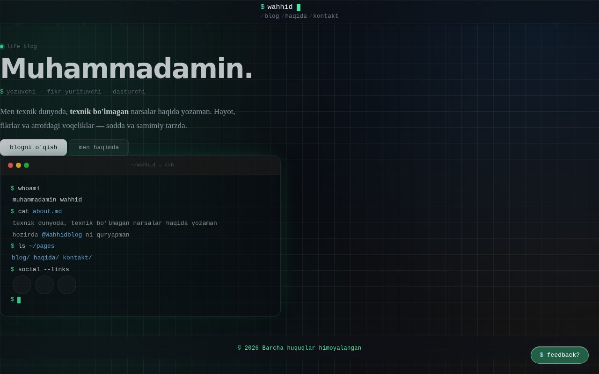
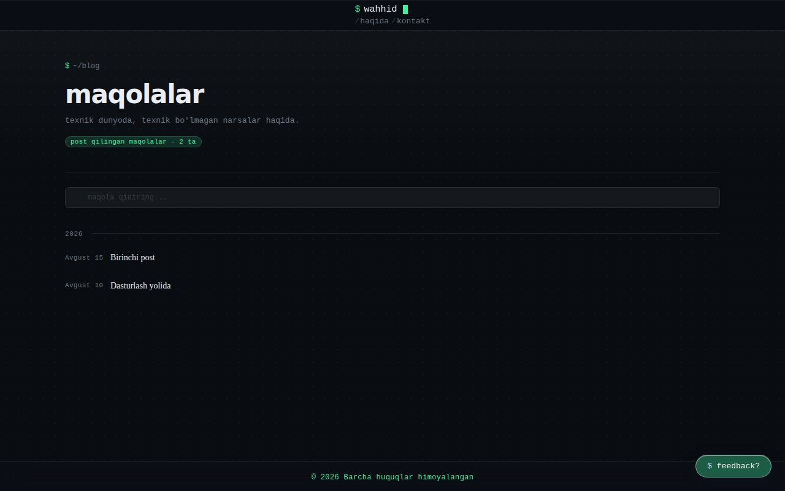
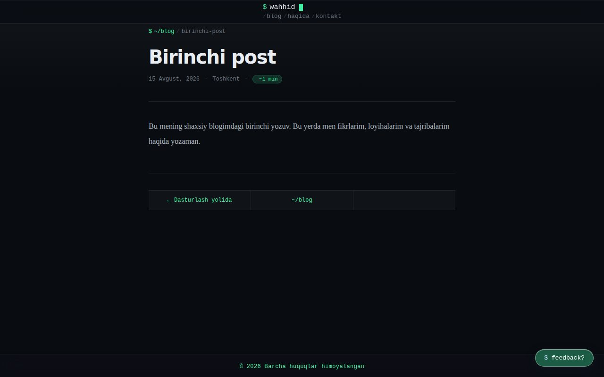
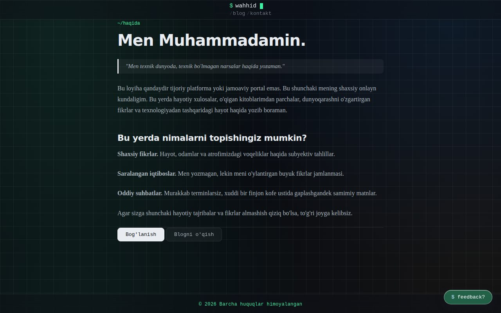
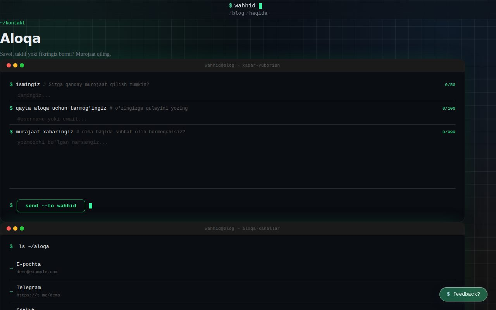
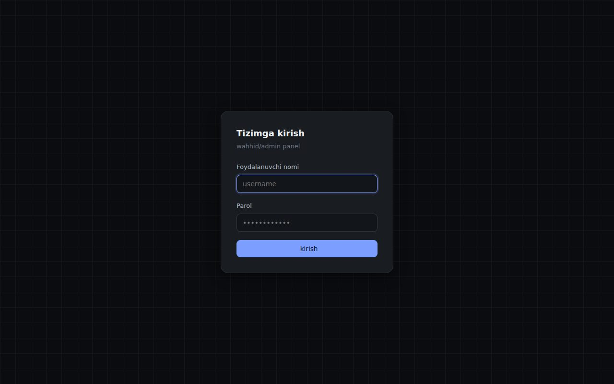
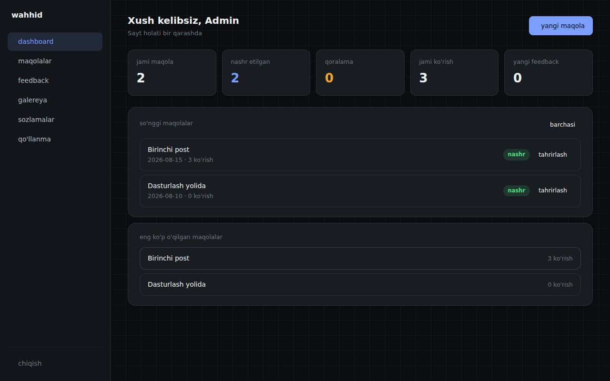

[🇺🇿 O'zbekcha](README.md) | [🇬🇧 English](README.en.md) | [🇷🇺 Русский](README.ru.md)

# wahhid — personal blog

A personal blog and journal platform built with Flask, styled like a terminal/code editor. Dark theme, `$` prompt aesthetic, and a fully functional admin panel.

## Features

- 📝 Articles — write, edit, save as drafts, autosave
- 🖼️ Gallery — image albums and media management
- 💬 Feedback and contact form — protected with per-IP rate limiting
- 📧 Email notifications for new messages via Gmail SMTP
- 🔐 Admin panel — login (with brute-force protection), settings, replying to messages
- 🎨 Terminal-style dark design (JetBrains Mono, green accent)

## Tech stack

- **Backend:** Python, Flask 3
- **Database:** SQLite
- **Server:** Gunicorn (for production)
- **Image handling:** Pillow
- **PDF generation:** ReportLab

## Installation

```bash
git clone https://github.com/idywahhid/veb-blog.git
cd veb-blog

python3 -m venv venv
source venv/bin/activate   # Windows: venv\Scripts\activate
pip install -r requirements.txt

cp .env.example .env
# Fill in .env (SECRET_KEY, ADMIN_PASSWORD_HASH, etc.)
```

Generate the admin password hash:

```bash
python make_hash.py
```

Copy the resulting value into `ADMIN_PASSWORD_HASH` in your `.env` file.

## Running

Development mode:

```bash
flask --app app run
```

Production:

```bash
gunicorn app:app -c gunicorn.conf.py
```

## Pages

### 🏠 Home (`/`)
Terminal-style landing page — a short introduction, links to recent articles, and an interactive "terminal" block with profile info.



### 📰 Blog (`/blog`)
All published articles grouped by date, with a search bar.



### 📄 Article (`/blog/<slug>`)
Full article text with reading time, location, and previous/next article navigation.



### 👤 About (`/about`)
A short story about the author and what readers can expect to find on the blog.



### ✉️ Contact (`/kontakt`)
Terminal-style message form plus a list of social/contact channels. Protected by rate limiting.



### 🔐 Admin — login (`/admin/login`)
Username/password login with brute-force protection.



### 📊 Admin — dashboard
Manage articles, feedback, gallery, and settings from one place.



## Environment variables

| Variable | Description |
|---|---|
| `SECRET_KEY` | Flask secret key (required in production) |
| `DEBUG` | Development mode (`true`/`false`) |
| `SESSION_COOKIE_SECURE` | Send cookies only over HTTPS (set `true` in production) |
| `ADMIN_USERNAME` | Admin panel username |
| `ADMIN_PASSWORD_HASH` | Password hash generated by `make_hash.py` |
| `DB_PATH` | Path to the SQLite database file |
| `CONTACT_EMAIL` / `CONTACT_TELEGRAM` / `CONTACT_LINKEDIN` / `CONTACT_GITHUB` | Links shown on the contact page |
| `TELEGRAM_CHANNEL` | Telegram channel link |

All variables are documented with examples in `.env.example`.

## Project structure

```
├── app.py              # Main Flask application
├── admin.py             # Admin panel routes
├── auth.py              # Password hashing/verification
├── config.py             # Loads settings from .env
├── database.py           # SQLite access layer
├── notifications.py       # Email notifications
├── templates/             # HTML templates
├── static/                # CSS, JS, images
└── requirements.txt        # Python dependencies
```

## License

Personal project. Feel free to adapt it for your own use.
